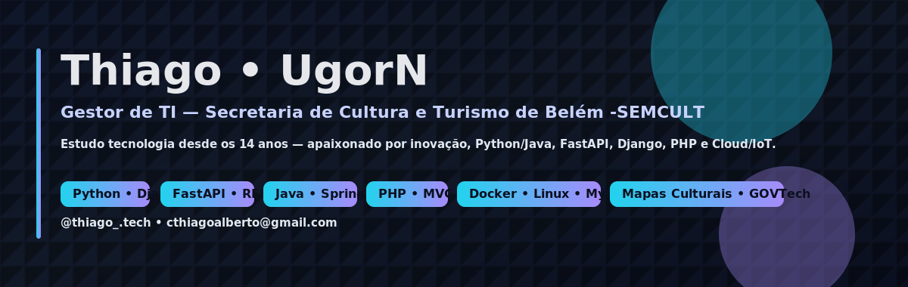

<picture>
  <source srcset="assets/banner.svg" type="image/svg+xml">
  
</picture>

# 👋 Olá, eu sou o Thiago (aka UgorN)

💻 **Gestor de TI na Secretaria de Cultura e Turismo de Belém -SEMCULT**  
📚 Estudante de **Análise e Desenvolvimento de Sistemas**  
🔒 Apaixonado por **Tecnologia, Coding & Cybersecurity**  

---

## 🚀 Sobre mim
- 👀 Interesse em: Desenvolvimento de sistemas, Python, Java, PHP, Segurança da Informação e Inovação.  
- 🌱 Atualmente aprendendo: **Java, Python (FastAPI, Django) e Cloud/IoT/Indústria 4.0**.  
- 💡 Estudo **tecnologia desde os 14 anos** e sou apaixonado por ela desde então.  
- 🎮 Fã de **arte, games e Resident Evil** 🧟‍♂️.  
- 🏋️‍♂️ Fora do código, pratico musculação e gosto de me desafiar constantemente.

---

## 🛠️ Linguagens & Ferramentas

---

## 💡 Projetos & Colaborações
- 🔧 Desenvolvimento de sistemas web e APIs.  
- 🗂️ Integrações com **Mapas Culturais** e plataformas digitais públicas.  
- 🌍 Projetos de transformação digital e inovação no setor público.  
- 💞️ Aberto para colaborar em **novos projetos de tecnologia e segurança**.

---

## 🚀 Projetos em destaque

- [Duck Manager](https://github.com/amazonnext/duck-manager)  
  Atuei como **frontend**, desenvolvendo os **menus principais** e as **configurações do sistema**.  
  
  
  

- [Calop Agender](https://github.com/amazonext/calop-agender)  
  Atuei como **backend**, criando as **opções principais de gerenciamento de agendas**.  
  
  
  

---

## 📊 GitHub Stats

  

---

## 📫 Como me encontrar
- Instagram: [@thiago_.tech](https://www.instagram.com/thiago_.tech/)  
- Email: [cthiagoalberto@gmail.com](mailto:cthiagoalberto@gmail.com)  

---

⭐ _"A tecnologia é a ponte entre a imaginação e a realidade."_
